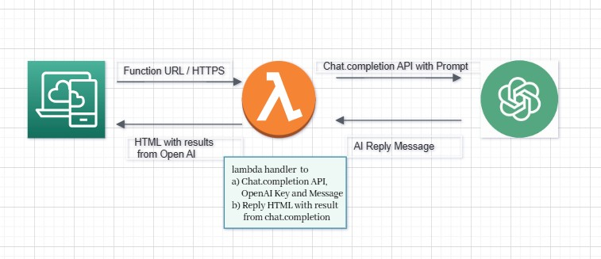

# Lambda-OpenAI-Interface-Example1

 

# **Description**

A simple [AWS Serverless](https://aws.amazon.com/serverless/) - [Lambda](https://aws.amazon.com/lambda/) application with a simple interface to Open AI to get interesting facts of a predefined location. It is implementation of [example applications](https://platform.openai.com/examples) found in the official OpenAI API documentation.

This is a first practice example to start learning to implement serverless application with the OpenAI interfaces.

# **Architecture**

Below is the architecture diagram with flow of data across the different components of AWS

[Architecture diagram](./docs/Lambda-OpenAI-Interface-Example1.jpg)

# **Quick Start**

Works with Linux, Windows, and macOS environments

1. Verify Project requirements: [AWS Account](https://aws.amazon.com/free/) and [Python 3.11](https://www.python.org/). For those who wants to use AWS CLI, then [CLI](https://aws.amazon.com/cli/) access
